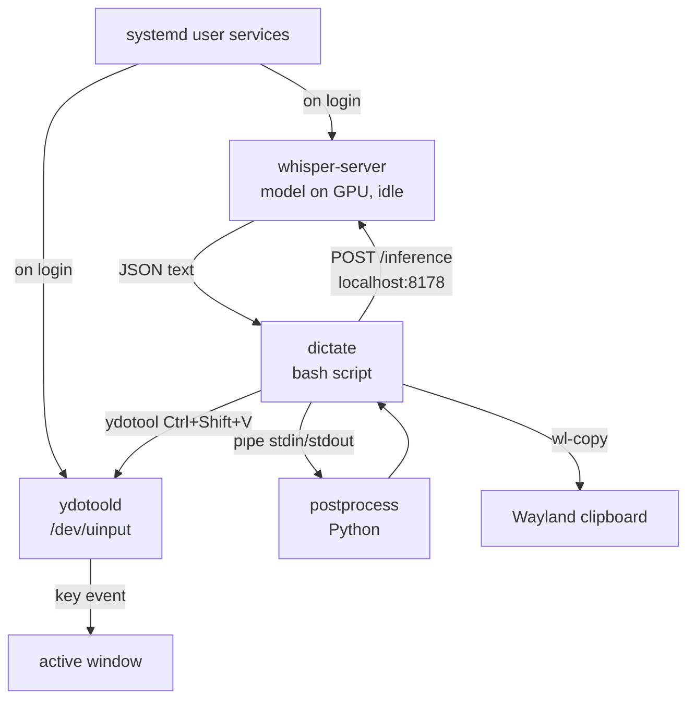

# voice — push-to-talk dictation for Linux (Wayland/KDE)

Press a key to start recording, press again to stop. Your speech is
transcribed by a local whisper.cpp server (GPU-accelerated) and pasted
into the active window.

Designed for dictating prose into terminal apps like Neovim and Claude
Code, where vim mode safety matters.

## Prerequisites

- **whisper.cpp** built from source with GPU support, including `whisper-server`
  (currently at `~/tools/whisper.cpp/`)
- A whisper model (currently `ggml-large-v3.bin`)
- **PipeWire** (for `pw-record`) to record audio
- **ydotool 1.0+** — kernel-level input injection (build from source,
  see below)
- **wl-clipboard** — Wayland clipboard access (`wl-copy`)
- **jq** — JSON parsing
- **curl**
- **Python 3** — post-processing (stdlib only, no pip packages)
- **notify-send** (libnotify) — desktop notifications

## Setup

### 1. ydotool (build from source)

The Ubuntu/Debian packaged ydotool (v0.1.8) uses an older key syntax
and lacks the `--mouse-off` flag. Build v1.0+ from source:

```bash
cd ~/tools
git clone https://github.com/ReimuNotMoe/ydotool.git
cd ydotool && mkdir build && cd build
cmake .. && make -j$(nproc)
sudo make install
```

This installs `ydotool` and `ydotoold` to `/usr/local/bin/`. If
v0.1.8 is installed via apt, remove it to avoid conflicts:

```bash
sudo apt remove ydotool
```

#### uinput permissions

ydotool needs access to `/dev/uinput`. Create a udev rule and add
yourself to the `input` group:

```bash
echo 'KERNEL=="uinput", GROUP="input", MODE="0660"' | sudo tee /etc/udev/rules.d/80-uinput.rules
sudo usermod -aG input $USER
sudo udevadm control --reload-rules && sudo udevadm trigger
```

The `udevadm` commands tell the kernel's device manager to re-read
its rule files and apply them to existing devices, so the permission
change takes effect immediately rather than requiring a reboot.

**Log out and back in** for the group change to take effect.

#### ydotoold daemon

ydotool 1.0+ requires the `ydotoold` daemon. Enable and start it:

```bash
systemctl --user daemon-reload
systemctl --user enable --now ydotoold
```

**Important:** On KDE Plasma Wayland, ydotoold must be started with
`--mouse-off` to create a keyboard-only virtual device. Without this,
the device registers as both keyboard and mouse, which can cause
issues. Create a systemd override:

```bash
mkdir -p ~/.config/systemd/user/ydotoold.service.d
cat > ~/.config/systemd/user/ydotoold.service.d/keyboard-only.conf <<'EOF'
[Service]
ExecStart=
ExecStart=/usr/local/bin/ydotoold --mouse-off
EOF
systemctl --user daemon-reload
systemctl --user restart ydotoold
```

### 2. Whisper server (systemd user service)

Install and start the service that keeps the whisper model loaded on
the GPU:

```bash
cp ~/voice/whisper-dictation.service ~/.config/systemd/user/
systemctl --user daemon-reload
systemctl --user enable --now whisper-dictation
```

The first start takes several seconds while the model loads into GPU
memory. Check status with:

```bash
systemctl --user status whisper-dictation
```

### 3. Keyboard shortcut

Bind a key to `~/voice/dictate` in your desktop environment.

**KDE Plasma:** System Settings → Shortcuts → Custom Shortcuts → Add
new → Command/URL. Set the trigger to your preferred key and the
command to `/home/nat/voice/dictate`.

#### Using numpad keys with input-remapper

KDE's custom shortcuts don't reliably capture numpad keys (like
KP_Enter or KP_Plus). **input-remapper** works around this by
remapping numpad keys to unused keycodes that KDE can bind:

```bash
sudo apt install input-remapper
```

In the input-remapper GUI, create mappings from numpad keys to
uncommon keycodes (e.g. KP_Enter → F13, KP_Plus → F14, KP_Minus →
F15, KP_Multiply → F16), then bind those keycodes in KDE's custom
shortcuts. input-remapper runs as a systemd service and applies
mappings at login.

Current bindings:

| Numpad key | KDE shortcut command             | Action                          |
|------------|----------------------------------|---------------------------------|
| Enter      | `dictate --log`                  | Copy/paste with post-processing |
| +          | `dictate --log copy`             | Copy only with post-processing  |
| −          | `dictate --log discard`          | Cancel recording                |
| *          | `dictate --log --raw`            | Copy/paste without post-processing |

## Usage

```
dictate [--log] [--raw] [discard|copy|copypaste]
```

### Action modes

| Action      | While recording                        | While not recording |
|-------------|----------------------------------------|---------------------|
| `copypaste` | Transcribe → copy → paste (default)    | Start recording     |
| `copy`      | Transcribe → copy to clipboard only    | Start recording     |
| `discard`   | Stop and discard recording             | No-op               |

### Basic workflow

1. Press your dictation key — a "Recording..." notification appears
2. Speak
3. Press the key again — recording stops, a "Transcribing..." notification
   appears, and after ~1-2 seconds the text is pasted into whatever
   window has focus

Bind separate keys for `discard` and `copy` to quickly cancel a
recording or grab text without pasting.

### Post-processing

Transcriptions are piped through the `postprocess` script which:

- **Suppresses hallucinations** — whisper outputs "Thank you." on
  silence; these are detected and suppressed
- **Fixes word corrections** — "clawed code" → "Claude Code", etc.
- **Converts spoken commands** — "new line" inserts a newline
- **Casing commands** — "camel get user end" → `getUser`, "snake
  my var end" → `my_var`, "all caps max size end" → `MAX_SIZE`,
  "quote hello world end quote" → `"hello world"`
- **Spoken punctuation** — "period" → `.`, "comma" → `,`, "question
  mark" → `?`, "colon" → `:`, "dash" → ` -- `, etc.
- **Capitalizes sentences** — uppercase after `.!?` and at start
- **Cleans whitespace** — collapses extra spaces and newlines

If post-processing fails, the raw whisper output is used as a fallback.
Use `--raw` to skip post-processing entirely and get the raw whisper
output.

### Logging

To log timing and transcription data for performance analysis:

```bash
dictate --log
```

This appends to `~/voice/dictate.log` with entries like:

```
--- 2026-02-25T22:20:13-07:00 [copypaste] ---
audio:     ~2s (39224 bytes)
stop:      205ms  (kill pw-record + sleep)
inference: 1823ms  (POST to whisper server)
done:      48ms  (wl-copy + ydotool)
total:     2076ms
raw:        This is a test of the dictation system.
text:      This is a test of the dictation system.
```

To use logging with a KDE shortcut, set the command to
`/home/nat/voice/dictate --log`.

## Theory of operation

### Architecture



### Why a persistent server?

Loading a whisper model into GPU memory takes several seconds.
Inference on loaded models takes ~1-2 seconds for typical utterances.
The server pays the load cost once at login rather than on every
dictation.

### Toggle mechanism

The `dictate` script is a toggle. Each invocation checks for a PID
file:

- **No PID file (or stale PID):** Starts `pw-record` in the
  background recording 16kHz 16-bit mono WAV (Whisper's native
  format). Saves the PID and exits. The `pw-record` process is
  detached with `disown` so it survives the script exiting.

- **Valid PID file:** Sends SIGINT to `pw-record` (so it cleanly
  finalizes the WAV header), waits 200ms, then POSTs the audio to the
  whisper server. The server returns JSON with the transcribed text.

### Text injection and vim safety

The transcribed text is injected via the system clipboard rather than
simulated keystrokes:

1. `wl-copy` places the text on the Wayland clipboard
2. `ydotool` simulates Ctrl+Shift+V (terminal paste shortcut)

The terminal emulator wraps clipboard content in **bracketed paste**
escape sequences (`\e[200~…\e[201~`). Neovim and other vim-mode
applications recognize bracketed paste and handle it correctly
regardless of the current mode — text is inserted, not interpreted as
commands. This is critical for avoiding destructive accidents when
focus is in a vim normal-mode buffer.

`ydotool` was chosen over `wtype` because KDE Plasma's KWin does not
implement the `zwp_virtual_keyboard_v1` Wayland protocol that wtype
requires. ydotool bypasses Wayland entirely by injecting events at the
Linux `/dev/uinput` kernel level. Version 1.0+ is required for raw
keycode syntax (`29:1 42:1 47:1 47:0 42:0 29:0` for Ctrl+Shift+V).

### Notifications

Desktop notifications provide feedback at each stage. Each
notification replaces the previous one in-place (using `notify-send
-p` to capture the ID and `-r` to replace it):

| Stage          | Timeout       |
|----------------|---------------|
| Recording...   | persistent    |
| Transcribing...| 10 seconds    |
| Done           | 4 seconds     |
| Copied         | 4 seconds     |
| Discarded      | 2 seconds     |
| Error          | 2 seconds     |

## Notes and issues

- **KDE shortcut closed file descriptors.** KDE custom shortcuts
  launch commands with stdin/stdout/stderr closed. `wl-copy` aborts if
  these aren't open. The script works around this by opening
  `/dev/null` on all three descriptors at startup.

- **Clobbers clipboard.** The paste-based injection overwrites whatever
  is on the Wayland clipboard. This is an accepted trade-off for vim
  safety.

- **ydotool keyboard layout.** ydotool 1.0+ uses raw keycodes, so
  keyboard layout doesn't matter for our use case — we only press
  Ctrl+Shift+V by keycode.

- **Ctrl+Shift+V is terminal-specific.** This paste shortcut works in
  Konsole, Kitty, Alacritty, WezTerm, and most modern terminal
  emulators. It will not work correctly in non-terminal GUI apps that
  expect Ctrl+V. The script is currently optimized for the terminal
  dictation use case.

- **Server `--convert` flag.** The whisper server is started with
  `--convert`, which uses ffmpeg to normalize audio before inference.
  This is a safety net — `pw-record` already outputs the correct
  format (16kHz 16-bit mono WAV), but `--convert` handles edge cases
  like truncated WAV headers if `pw-record` is killed at an unlucky
  moment. This adds latency (ffmpeg fork+exec per request). If
  performance is a priority and recordings are reliable, consider
  removing `--convert` from the service file.

- **Temp files.** The WAV recording and PID file are stored in
  `$XDG_RUNTIME_DIR` (typically `/run/user/$UID/`), a RAM-backed tmpfs
  that is cleaned up on logout.

## Future enhancements

- **Save/restore clipboard.** Snapshot the clipboard before dictation
  and restore it after pasting, to avoid clobbering.

- **Detect active window type.** Use Ctrl+Shift+V for terminals and
  Ctrl+V for GUI apps. Could inspect the focused window class via
  `kdotool` or KWin scripting.

- **Neovim remote API.** When `$NVIM` is set, use Neovim's RPC socket
  to insert text directly via the API, bypassing the clipboard
  entirely. This would be the cleanest solution for Neovim
  specifically.

- **Streaming transcription.** For long dictations, send audio chunks
  incrementally rather than waiting for the full recording. whisper.cpp
  supports streaming, though the server endpoint does not currently
  expose it.

- **Model selection.** Allow switching between small/medium/large
  models via a flag or environment variable, trading accuracy for
  speed.

- **Prompt context.** The whisper server supports an `--prompt` flag
  for providing context that biases the decoder. Could be used to
  improve accuracy for domain-specific vocabulary.

- **Talon.** If latency or accuracy requirements grow, Talon provides
  real-time transcription with its own Conformer speech engine and a
  full voice command grammar system. It's a significant step up in
  complexity but also capability.
